# 用责任链模式设计拦截器

我在 Redant(https://github.com/all4you/redant) 中通过继承 ChannelHandler 实现了拦截器的功能，并且 pipeline 就是一种责任链模式的应用。但是我后面对原本的拦截器进行了重新设计，为什么这样做呢，因为原本的方式是在 ChannelHandler 的基础上操作的，而我们知道 Netty 的数据处理都是基于 ByteBuf 的，这就涉及到引用计数释放的问题，前面的 ChannelHandler 在处理时可以不关心引用计数的问题，而交给最后一个 ChannelHandler 去释放。

但是拦截器的一大特性就是当某个条件不满足时需要中断后面的操作直接返回，所以这就造成了在 pipeline 中某个节点需要释放引用计数，另外一个方面就是原先的设计使用了很多自定义的 ChannelHandler，有的只做了一些简单的工作，所以完全可以对他们进行合并，使代码变得更加精简紧凑。

合并多个 ChannelHandler 是比较简单的，重新设计拦截器相对就复杂一些了。

## 重新设计拦截器

首先我把原本的前置拦截器和后置拦截器统一成一个拦截器，然后抽象出两个方法，分别表示：前置处理，后置处理，如下图所示：

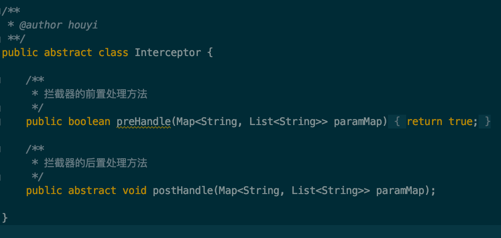

默认前置处理的方法返回 true，用户可以根据他们的业务进行覆盖。

这里是定义了一个抽象类，也可以用接口，java 8 开始接口中可以有默认方法实现。

拦截器定义好之后，现在就可以在 ChannelHandler 中加入拦截器的方法调用了，如下图所示：

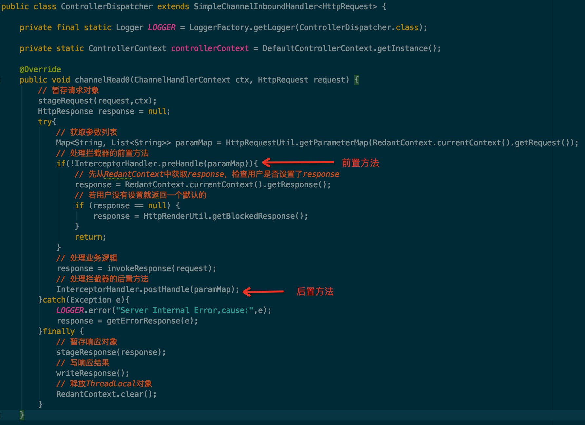

当前置方法返回 false 时，直接返回，中断后面的业务逻辑处理，最终会到 finally 中将结果写入 response 中返回给前端。

现在只要实现 InterceptorHandler 中的两个方法就可以了，其实这也很简单，只要获取到所有的 Interceptor 的实现类，然后依次调用这些实现类的前置方法和后置方法就好了，如下图所示：

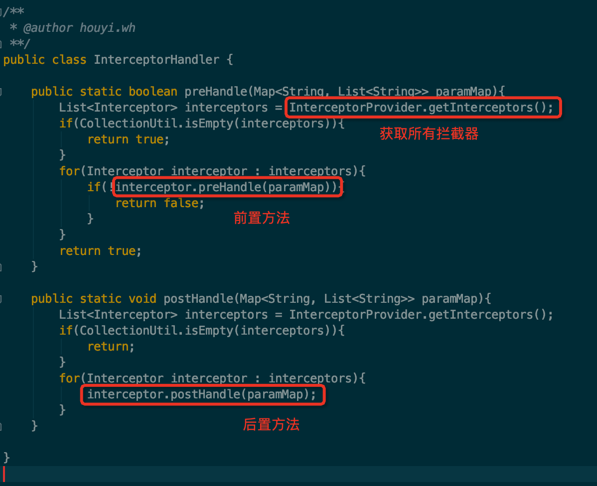

## 获取拦截器

现在的重点就是怎样获取到所有的拦截器，首先可以想到的是通过扫描的方法，找到所有 Interceptor 的实现类，然后将这些实现类加入到一个 List 中即可。

那怎么保证拦截器的执行顺序呢，很简单，只要在加入 List 之前对他们进行排序就可以了。再定义一个 @Order 注解来表示排序的顺序，然后用一个 Wrapper 包装类将 Interceptor 和 Order 包装起来，排序到包装类的 List 中，最后再从包装类的 List 中依次取出所有的 Interceptor 就完成了 Interceptor 的排序了。

知道了大致的原理之后，实现起来就很简单了，如下图所示：

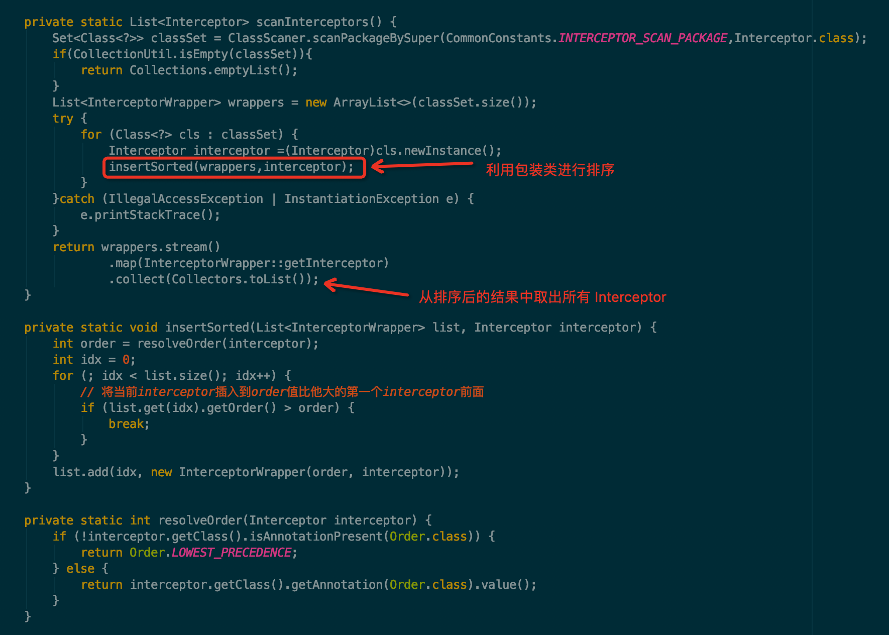

但是我们不能每次都通过调用 scanInterceptors() 方法来获取所有的拦截器，如果这样每次都扫描一次的话性能会有影响，所以我们只需要第一次调用一下该方法，然后把结果保存在一个私有的变量中，获取的时候直接读取该变量的值即可，如下图所示：

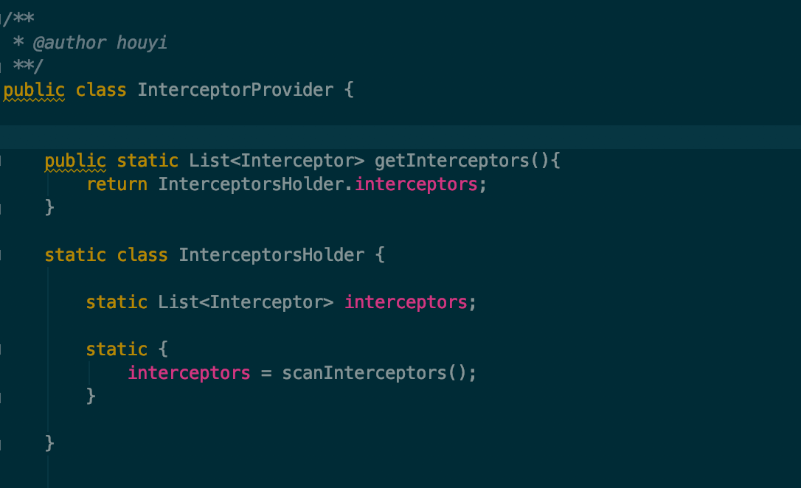

## 自定义拦截器实现类

下面让我们来自定义两个拦截器实现类，来验证下具体的效果。

第一个拦截器，在前置方法中对请求参数进行判断，如果请求参数中有 block=true 的参数，则进行拦截，如下图所示：

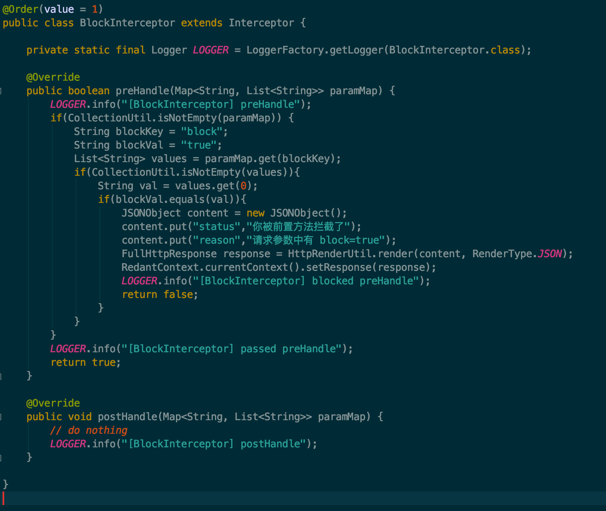

第二个拦截器，在后置方法中打印出每次请求的耗时，如下图所示：

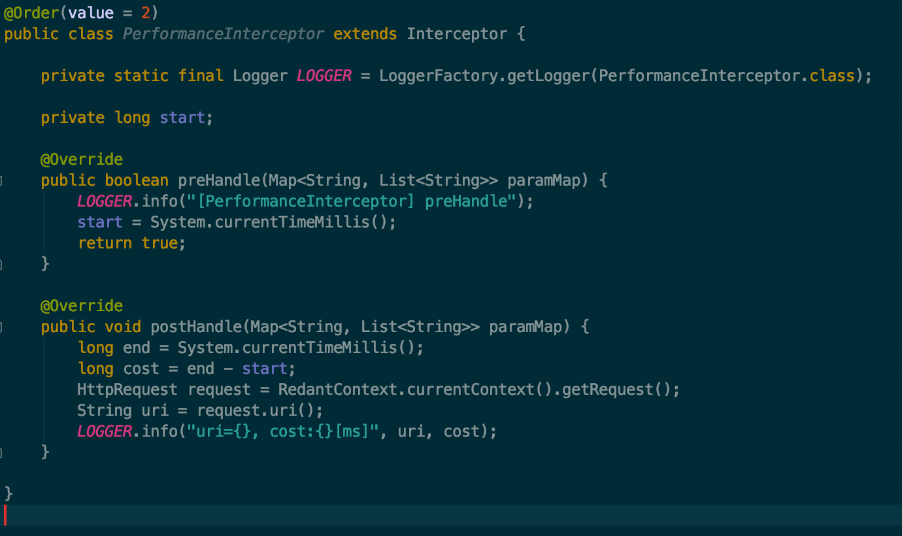

通过 @Order 注解来指定执行的顺序，先执行 BlockInterceptor 再执行 PerformanceInterceptor。

## 查看效果

现在我们请求 /user/info 这个接口，查看下效果。

首先我们只提交正常的参数，如下图所示：

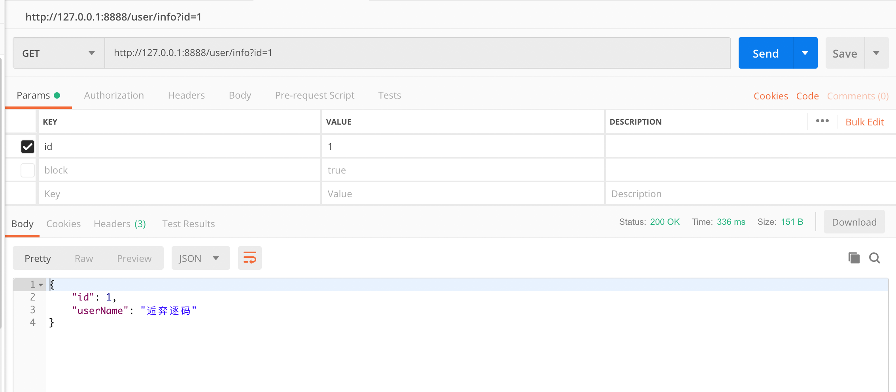

打印的结果如下图所示：

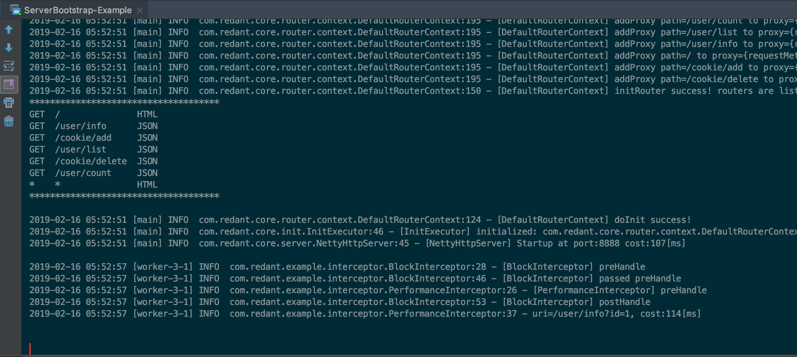

从打印的结果中可以看到依次执行了:

- BlockInterceptor 的 preHandle 方法
- PerformanceInterceptor 的 preHandle方法
- BlockInterceptor 的 postHandle 方法 
- PerformanceInterceptor 的 postHandle方法

这说明拦截器是按照 @Order 注解进行了排序，然后依次执行的。

然后我们再提交一个 block=true 的参数，再次请求该接口，如下图所示：

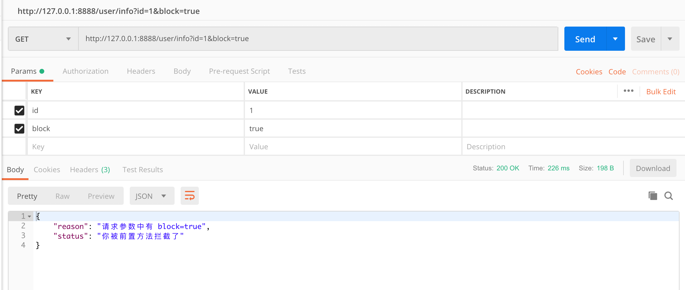

可以看到该请求已经被拦截器的前置方法给拦截了，再看下打印的日志，如下图所示：

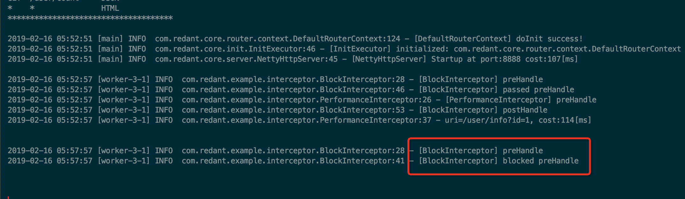

只打印了 BlockInterceptor 的 preHandler 方法中的部分日志，后面的方法都没有执行，因为被拦截了直接返回了。

## 存在的问题

到这里已经对拦截器完成了改造，并且也验证了效果，看上去效果还可以。但是有没有什么问题呢？

还真有一个问题：所有的 Interceptor 实现类只要被扫描到了，就会被加入到 List 中去，如果不想应用某一个拦截器这时就做不到了，因为无法对 list 中的值进行动态的更改。

如果我们可以动态的获取一个保存了 Interceptor 的 list ，如果该 list 中没有获取到值，再通过扫描的方式去拿到所有的 Interceptor 这样就完美了。

动态获取 Interceptor 的 list 的方法，可以由用户自定义实现，根据某些规则来确定要不要将某个 Interceptor 加入到 list 中去，这样就把 Interceptor 的实现和使用进行了解耦了。用户可以实现任意多的 Interceptor，但是只根据规则去使用其中的某些 Interceptor。

理清楚了原理之后，就很好实现了，首先定义一个接口，用来构造 Interceptor 的 List，如下图所示：

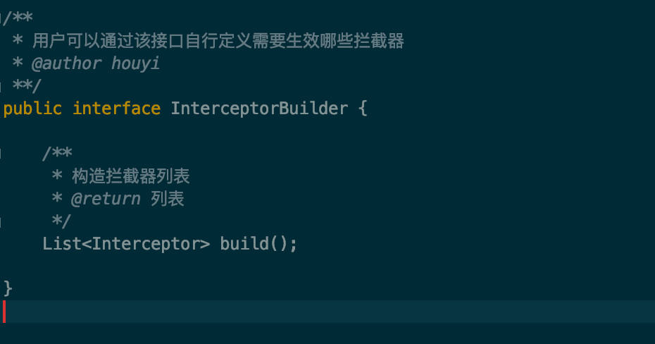

有了 InterceptorBuilder 之后，在获取 Interceptor 的时候，就可以先根据 InterceptorBuilder 来获取了，如下图所示：

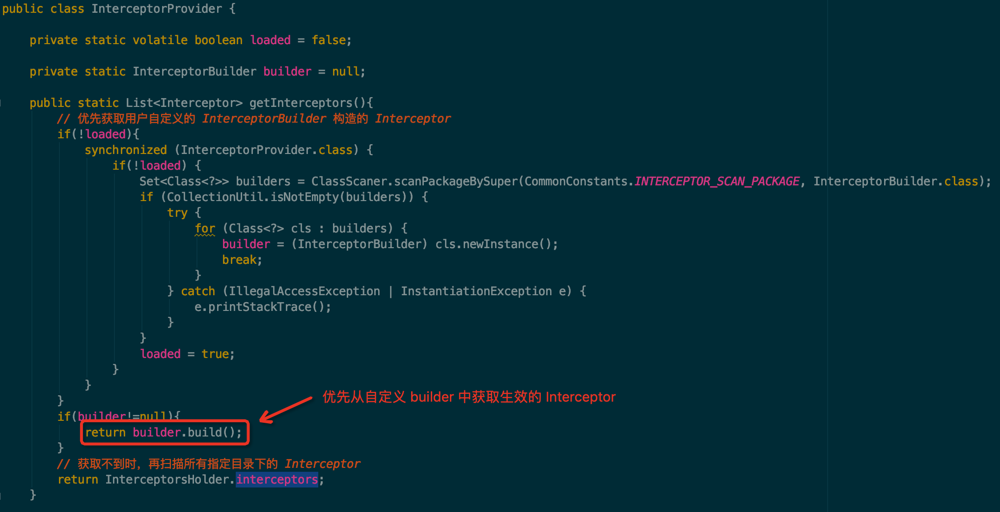

以下是一个示例的 InterceptorBuilder，具体的可以用户自行扩展设计，如下图所示：

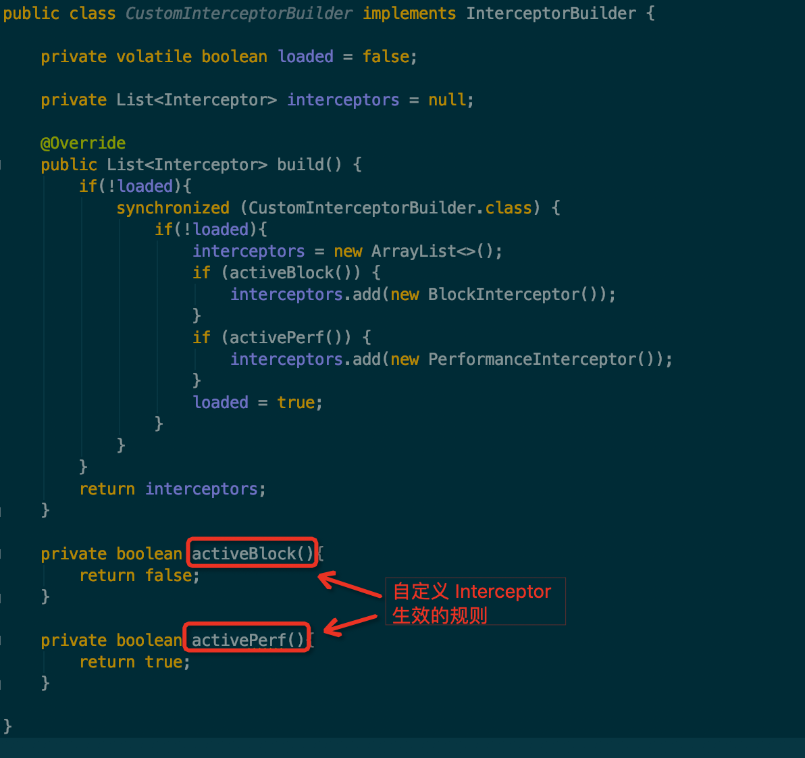

这样用户只要实现一个 InterceptorBuilder 接口，即可按照自己的意图去组装所有的拦截器。
