**RedAnt** 是一个基于 Netty 的轻量级 Web 容器，创建这个项目的目的主要是学习使用 Netty，俗话说不要轻易的造轮子，但是通过造轮子我们可以学到很多优秀开源框架的设计思路，编写优美的代码，更好的提升自己。

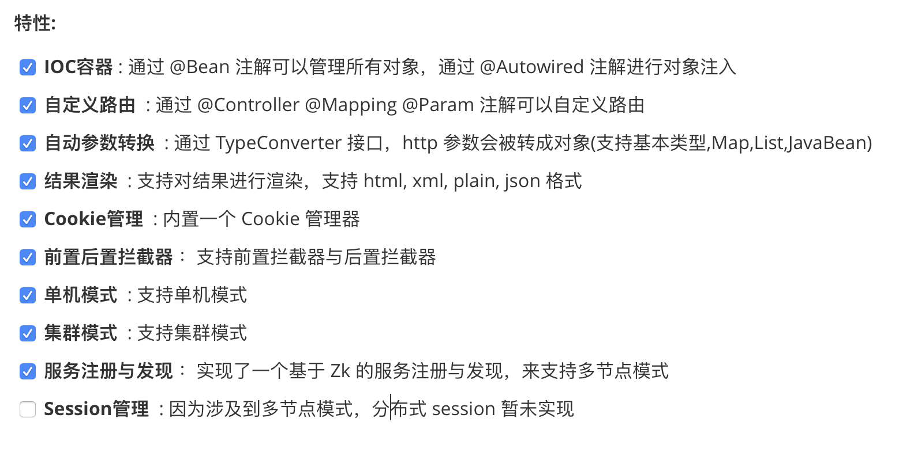


## 快速启动

Redant 是一个基于 Netty 的 Web 容器，类似 Tomcat 和 WebLogic 等容器

只需要启动一个 Server，默认的实现类是 NettyHttpServer 就能快速启动一个 web 容器了，如下所示：

```java
public final class ServerBootstrap {
    public static void main(String[] args) {
        Server nettyServer = new NettyHttpServer();
        // 各种初始化工作
        nettyServer.preStart();
        // 启动服务器
        nettyServer.start();
    }
}
```

我们可以直接启动 redant-example 模块中的 ServerBootstrap 类，因为 redant-example 中有很多示例的 Controller，我们直接运行 example 中的 ServerBootstrap，启动后你会看到如下的日志信息：

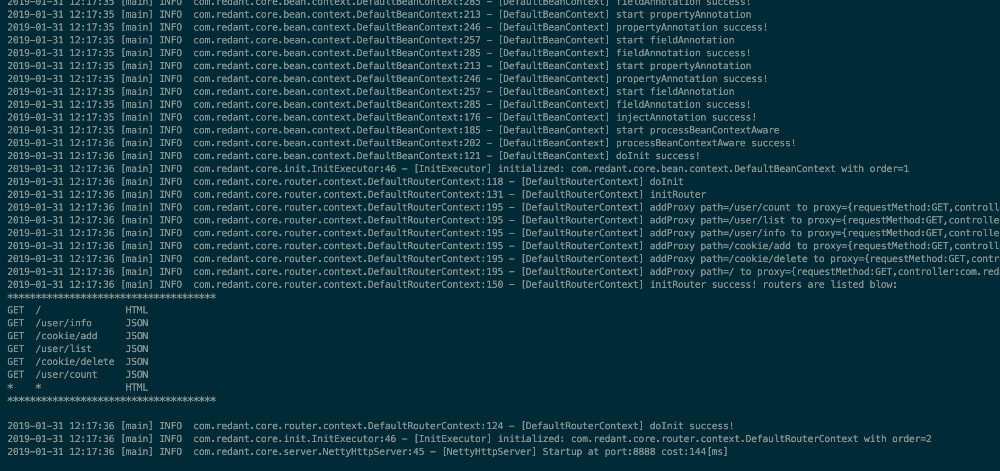

在 redant-example 模块中，内置了以下几个默认的路由:

| 方法类型 | URL         | 响应类型 |
| -------- | ----------- | -------- |
| GET      | /           | HTML     |
| \*       | \*          | HTML     |
| GET      | /user/count | JSON     |
| GET      | /user/list  | JSON     |
| GET      | /user/info  | JSON     |

启动成功后，可以访问 http://127.0.0.1:8888/ 查看效果，如下图所示：

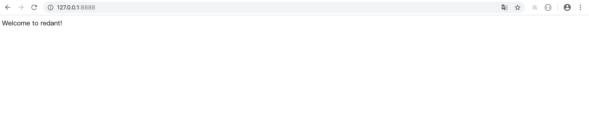

如果你可以看到 "Welcome to redant!"  这样的消息，那就说明你启动成功了。


## 自定义路由

框架实现了自定义路由，通过 @Controller @Mapping 注解就可以唯一确定一个自定义路由。如下列的 UserController 所示：

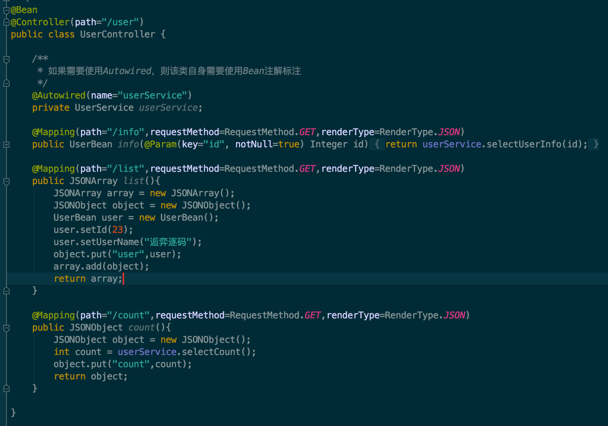

和 Spring 的使用方式一样，访问 /user/list 来看下效果，如下图所示：

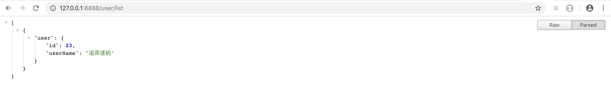


## 结果渲染

目前支持 json、html、xml、text 等类型的结果渲染，用户只需要在 方法的 @Mapping 注解上通过 renderType 来指定具体的渲染类型即可，如果不指定的话，默认以 json 类型范围。

如下图所示，首页就是通过指定 renderType 为 html 来返回一个 html 页面的：

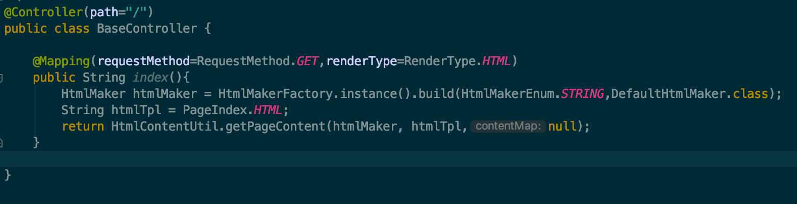


## IOC容器

从 UserController 的代码中，我们看到 userServerce 对象是通过 @Autowired 注解自动注入的，这个功能是任何一个 IOC 容器基本的能力，下面我们来看看如何实现一个简单的 IOC 容器。

首先定义一个 BeanContext 接口，如下所示：

``` java
public interface BeanContext {
    /**
     * 获得Bean
     * @param name Bean的名称
     * @return Bean
     */
    Object getBean(String name);
    /**
     * 获得Bean
     * @param name Bean的名称
     * @param clazz Bean的类
     * @param <T> 泛型
     * @return Bean
     */
    <T> T getBean(String name,Class<T> clazz);
}
```

然后我们需要在系统启动的时候，扫描出所有被 @Bean 注解修饰的类，然后对这些类进行实例化，然后把实例化后的对象保存在一个 Map 中即可，如下图所示：

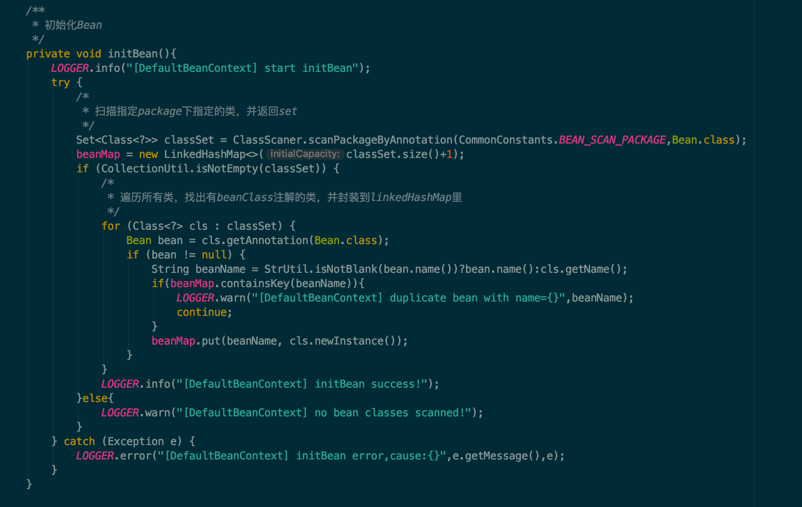

代码很简单，通过在指定路径下扫描出所有的类之后，把实例对象加入map中，但是对于已经加入的 bean 不能继续加入了，加入之后要获取一个 Bean 也很简单了，直接通过 name 到 map 中去获取就可以了。

现在我们已经把所有 @Bean 的对象管理起来了，那对于依赖到的其他的 bean 该如何注入呢，换句话说就是将我们实例化好的对象赋值给 @Autowired 注解修饰的变量。

简单点的做法就是遍历 beanMap，然后对每个 bean 进行检查，看这个 bean 里面的每个 setter 方法和属性，如果有 @Autowired 注解，那就找到具体的 bean 实例之后将值塞进去。

### setter注入

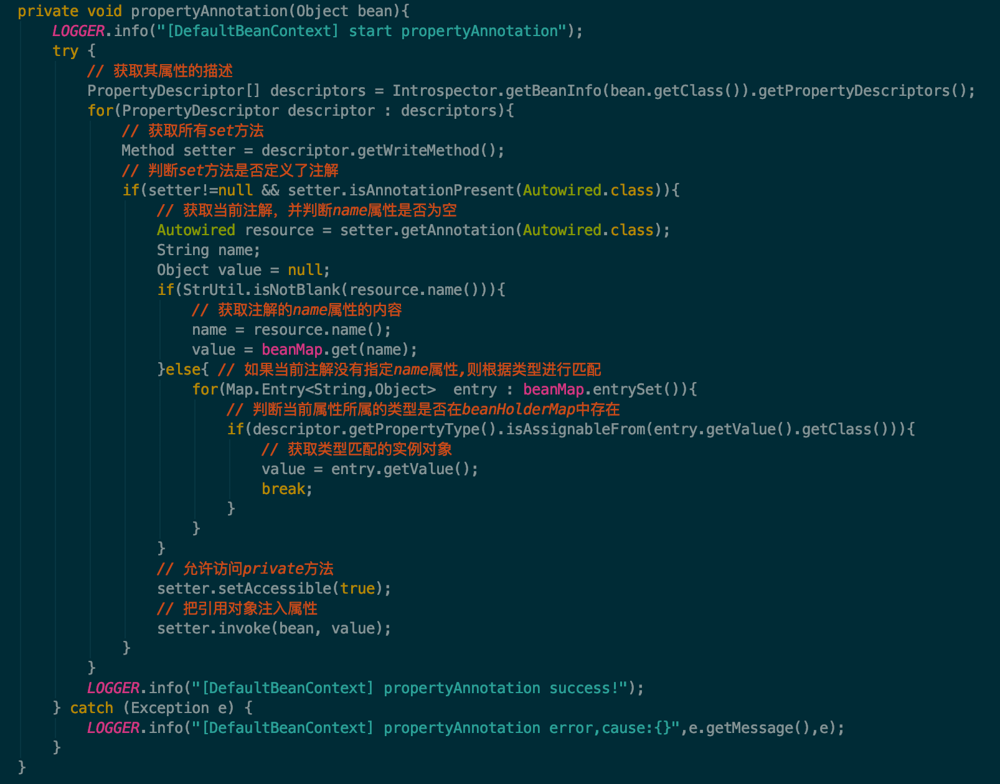

### field注入

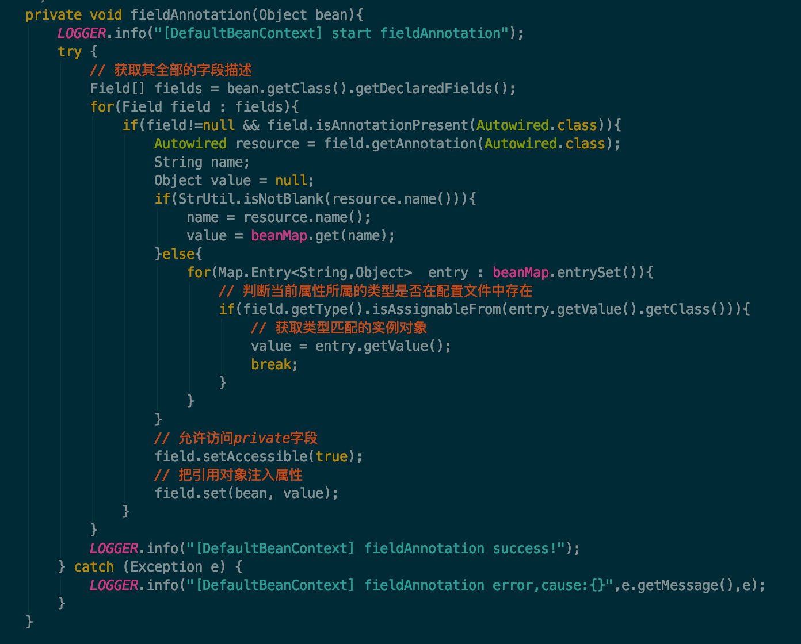

### 通过Aware获取BeanContext

BeanContext 已经实现了，那怎么获取 BeanContext 的实例呢？想到 Spring 中有很多的 Aware 接口，每种接口负责一种实例的回调，比如我们想要获取一个 BeanFactory 那只要将我们的类实现 BeanFactoryAware 接口就可以了，接口中的 setBeanFactory(BeanFactory factory) 方法参数中的 BeanFactory 实例就是我们所需要的，我们只要实现该方法，然后将参数中的实例保存在我们的类中，后续就可以直接使用了。

那现在我就来实现这样的功能，首先定义一个 Aware 接口，所有其他需要回调塞值的接口都继承自该接口，如下所示：

``` java
public interface Aware {

}

public interface BeanContextAware extends Aware{

    /**
     * 设置BeanContext
     * @param beanContext BeanContext对象
     */
    void setBeanContext(BeanContext beanContext);
}
```

接下来需要将 BeanContext 的实例注入到所有 BeanContextAware 的实现类中去。BeanContext 的实例很好得到，BeanContext 的实现类本身就是一个 BeanContext 的实例，并且可以将该实例设置为单例，这样的话所有需要获取 BeanContext 的地方都可以获取到同一个实例。

拿到 BeanContext 的实例后，我们就需要扫描出所有实现了 BeanContextAware 接口的类，并实例化这些类，然后调用这些类的 setBeanContext 方法，参数就传我们拿到的 BeanContext 实例。

逻辑理清楚之后，实现起来就很简单了，如下图所示：

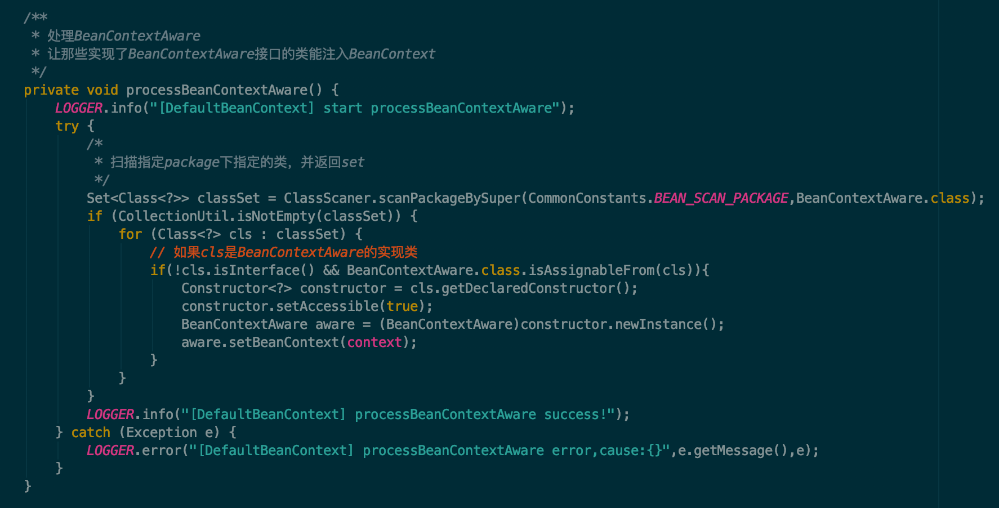


## Cookie管理

基本上所有的 web 容器都会有 cookie 管理的能力，那我们的 redant 也不能落后。首先定义一个 CookieManager 的接口，核心的操作 cookie 的方法如下：

``` java
public interface CookieManager {

    Set<Cookie> getCookies();

    Cookie getCookie(String name);
    
    void addCookie(String name,String value);

    void setCookie(Cookie cookie);

    boolean deleteCookie(String name);

}
```

其中我只列举了几个核心的方法，另外有一些不同参数的重载方法，这里就不详细介绍了。最关键的是两个方法，一个是读 Cookie 一个是写 Cookie 。

### 读 Cookie

Netty 中是通过 HttpRequest 的 Header 来保存请求中所携带的 Cookie的，所以要读取 Cookie 的话，最关键的是获取到 HttpRequest。而 HttpRequest 可以在 ChannelHandler 中拿到，通过 HttpServerCodec 编解码器，Netty 已经帮我们把请求的数据转换成 HttpRequest 了。但是这个 HttpRequest 只在 ChannelHandler 中才能访问到，而处理 Cookie 通常是用户自定义的操作，并且对用户来说他是不关心 HttpRequest 的，他只需要通过 CookieManager 去获取一个 Cookie 就行了。

这种情况下，最适合的就是将 HttpRequest 对象保存在一个 ThreadLocal 中，在 CookieManager 中需要获取的时候，直接到 ThreadLocal 中去取出来就可以了，如下列代码所示：

``` java
@Override
public Set<Cookie> getCookies() {
    HttpRequest request = TemporaryDataHolder.loadHttpRequest();
    Set<Cookie> cookies = new HashSet<>();
    if(request != null) {
        String value = request.headers().get(HttpHeaderNames.COOKIE);
        if (value != null) {
            cookies = ServerCookieDecoder.STRICT.decode(value);
        }
    }
    return cookies;
}
```

TemporaryDataHolder 就是那个通过 ThreadLocal 保存了 HttpRequest 的类。

### 写 Cookie

写 Cookie 和读 Cookie 面临着一样的问题，就是写的时候需要借助于 HttpResponse，将 Cookie 写入 HttpResponse 的 Header 中去，但是用户执行写 Cookie 操作的时候，根本就不关心 HttpResponse，甚至他在写的时候，还没有 HttpResponse。

这时的做法也是将需要写到 HttpResponse 中的 Cookie 保存在 ThreadLocal 中，然后在最后通过 channel 写响应之前，将 Cookie 拿出来塞到 HttpResponse 中去即可，如下列代码所示：

``` java
@Override
public void setCookie(Cookie cookie) {
    TemporaryDataHolder.storeCookie(cookie);
}

/**
 * 响应消息
 */
private void writeResponse(){
    boolean close = isClose();
    response.headers().add(HttpHeaderNames.CONTENT_LENGTH, String.valueOf(response.content().readableBytes()));
    // 从ThreadLocal中取出待写入的cookie
    Set<Cookie> cookies = TemporaryDataHolder.loadCookies();
    if(!CollectionUtil.isEmpty(cookies)){
        for(Cookie cookie : cookies){
            // 将cookie写入response中
            response.headers().add(HttpHeaderNames.SET_COOKIE, ServerCookieEncoder.STRICT.encode(cookie));
        }
    }
    ChannelFuture future = channel.write(response);
    if(close){
        future.addListener(ChannelFutureListener.CLOSE);
    }
}
```


## 拦截器

拦截器是一个框架很重要的功能，通过拦截器可以实现一些通用的工作，比如登录鉴权，事务处理等等。记得在 Servlet 的年代，拦截器是非常重要的一个功能，基本上每个系统都会在 web.xml 中配置很多的拦截器。

拦截器的基本思想是，通过一连串的类去执行某个拦截的操作，一旦某个类中的拦截操作返回了 false，那就终止后面的所有流程，直接返回。

这种场景非常适合用责任链模式去实现，而 Netty 的 pipeline 本身就是一个责任链模式的应用，所以我们就可以通过 pipeline 来实现我们的拦截器。这里我定义了两种类型的拦截器：前置拦截器和后置拦截器。

前置拦截器是在处理用户的业务逻辑之前的一个拦截操作，如果该操作返回了 false 则直接 return，不会继续执行用户的业务逻辑。

后置拦截器就有点不同了，后置拦截器主要就是处理一些后续的操作，因为后置拦截器再跟前置拦截器一样，当操作返回了 false 直接 return 的话，已经没有意义了，因为业务逻辑已经执行完了。

理解清楚了具体的逻辑之后，实现起来就很简单了，如下列代码所示：

### 前置拦截器

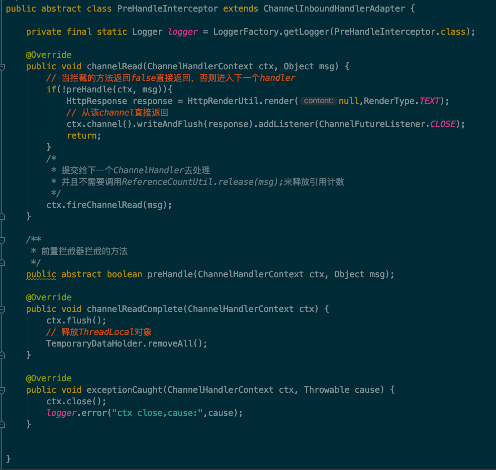

### 后置拦截器


有了实现之后，我们需要把他们加到 pipeline 中合适的位置，让他们在整个责任链中生效，如下图所示：

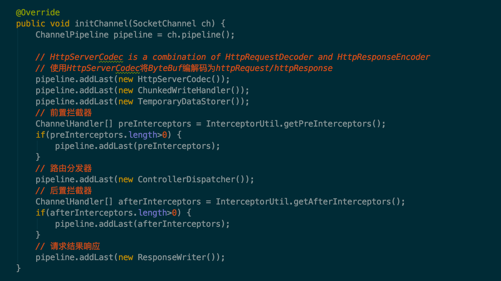

### 指定拦截器的执行顺序

目前拦截器还没有实现指定顺序执行的功能，其实也很简单，可以定义一个 @InterceptorOrder 的注解应用在所有的拦截器的实现类上，扫描到拦截器的结果之后，根据该注解进行排序，然后把拍完序之后的结果添加到 pipeline 中即可。


## 集群模式

到目前为止，我描述的都是单节点模式，如果哪一天单节点的性能无法满足了，那就需要使用集群了，所以我也实现了集群模式。

集群模式是由一个主节点和若干个从节点构成的。主节点接收到请求后，将请求转发给从节点来处理，从节点把处理好的结果返回给主节点，由主节点把结果响应给请求。

要想实现集群模式需要有一个服务注册和发现的功能，目前是借助于 Zk 来做的服务注册与发现。

### 准备一个 Zk 服务端

因为主节点需要把请求转发给从节点，所以主节点需要知道目前有哪些从节点，我通过 ZooKeeper 来实现服务注册与发现。

如果你没有可用的 Zk 服务端的话，那你可以通过运行下面的 Main 方法来启动一个 ZooKeeper 服务端：

```java
public final class ZkBootstrap {
    private static final Logger LOGGER = LoggerFactory.getLogger(ZkBootstrap.class);

    public static void main(String[] args) {
        try {
            ZkServer zkServer = new ZkServer();
            zkServer.startStandalone(ZkConfig.DEFAULT);
        }catch (Exception e){
            LOGGER.error("ZkBootstrap start failed,cause:",e);
            System.exit(1);
        }
    }
}
```

这样你就可以在后面启动主从节点的时候使用这个 Zk 了。但是这并不是必须的，如果你已经有一个正在运行的 Zk 的服务端，那么你可以在启动主从节点的时候直接使用它，通过在 main 方法的参数中指定 Zk 的地址即可。

### 启动主节点

只需要运行下面的代码，就可以启动一个主节点了：

```java
public class MasterServerBootstrap {
    public static void main(String[] args) {
        String zkAddress = ZkServer.getZkAddressArgs(args,ZkConfig.DEFAULT);

        // 启动MasterServer
        Server masterServer = new MasterServer(zkAddress);
        masterServer.preStart();
        masterServer.start();
    }
}
```

如果在 main 方法的参数中指定了 Zk 的地址，就通过该地址去进行服务发现，否则会使用默认的 Zk 地址。

### 启动从节点

只需要运行下面的代码，就可以启动一个从节点了：

```java
public class SlaveServerBootstrap {

    public static void main(String[] args) {
        String zkAddress = ZkServer.getZkAddressArgs(args,ZkConfig.DEFAULT);
        Node node = Node.getNodeWithArgs(args);

        // 启动SlaveServer
        Server slaveServer = new SlaveServer(zkAddress,node);
        slaveServer.preStart();
        slaveServer.start();
    }

}
```

如果在 main 方法的参数中指定了 Zk 的地址，就通过该地址去进行服务注册，否则会使用默认的 Zk 地址。

实际上多节点模式具体的处理逻辑还是复用了单节点模式的核心功能，只是把原本一台实例扩展到多台实例而已。


## 总结

本文通过介绍一个基于 Netty 的 web 容器，让我们了解了一个 http 服务端的大概的构成，当然实现中可能有更加好的方法。但是主要的还是要了解内在的思想，包括 Netty 的一些基本的使用方法。

我会继续优化该项目，加入更多的特性，例如服务发现与注册当前是通过 Zk 来实现的，未来可能会引入其他的组件去实现服务注册与发现。

除此之外，Session 的管理还未完全实现，后续也需要对这一块进行完善。


