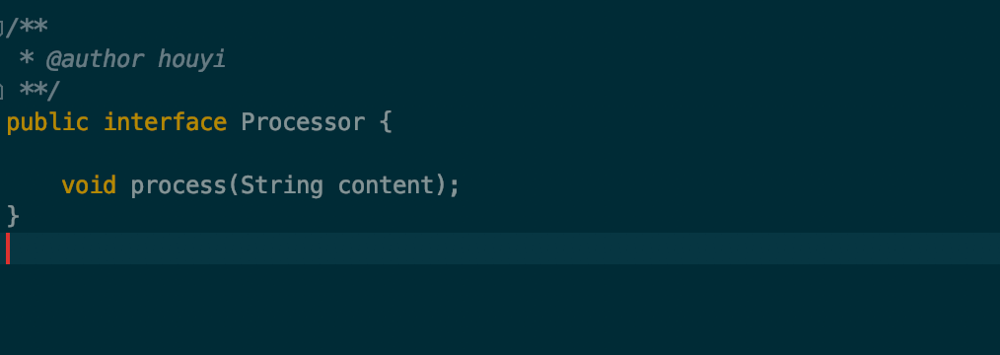
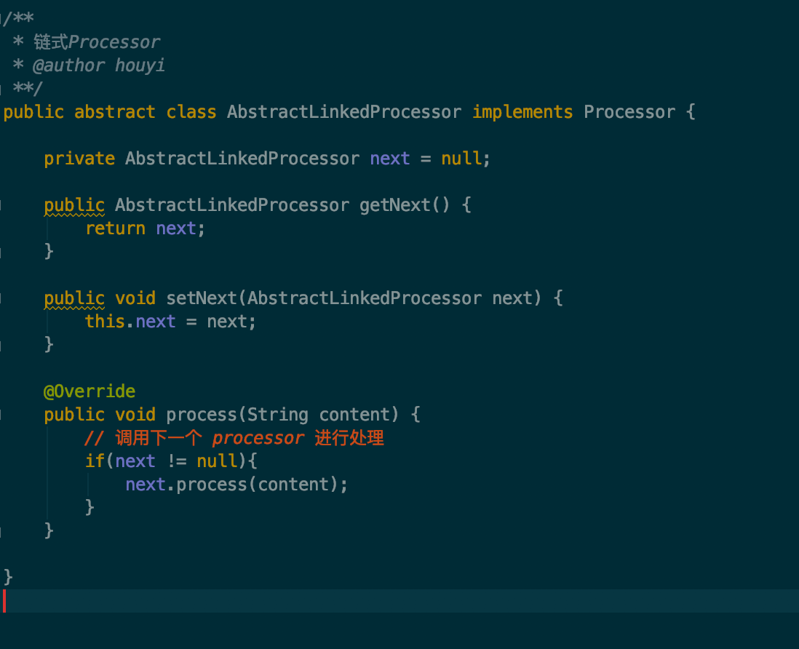
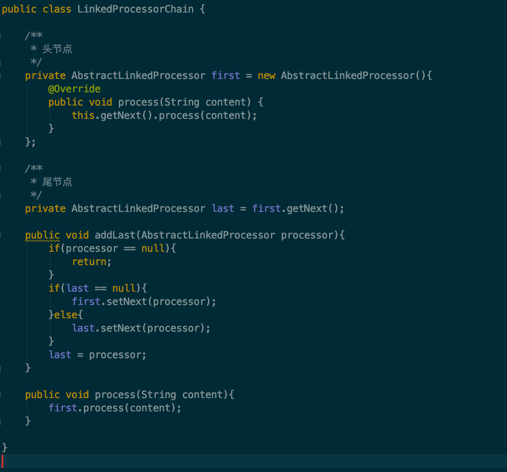
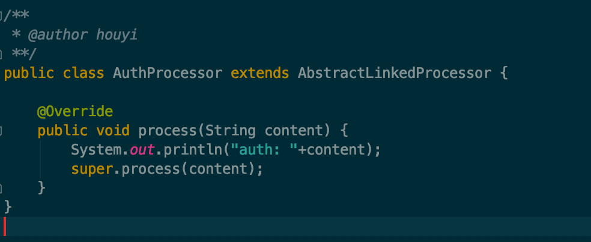
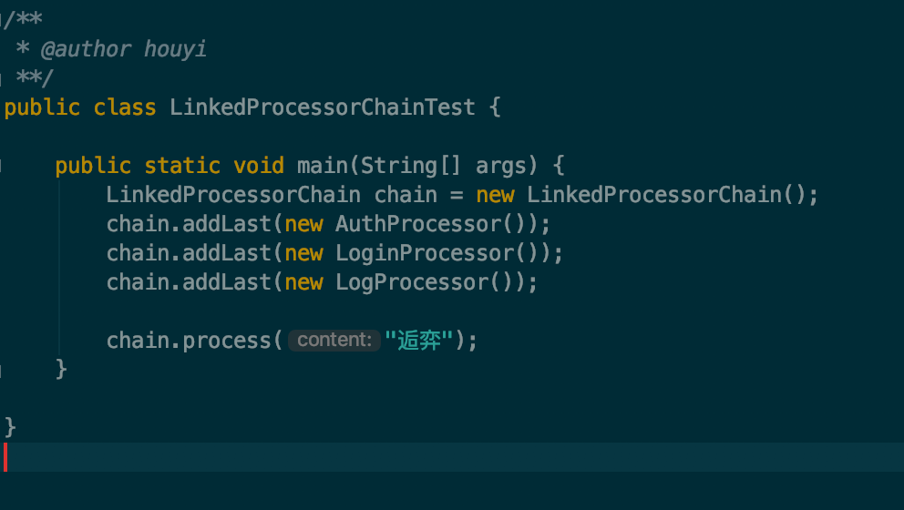
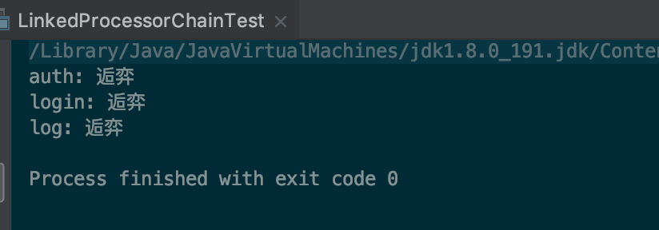
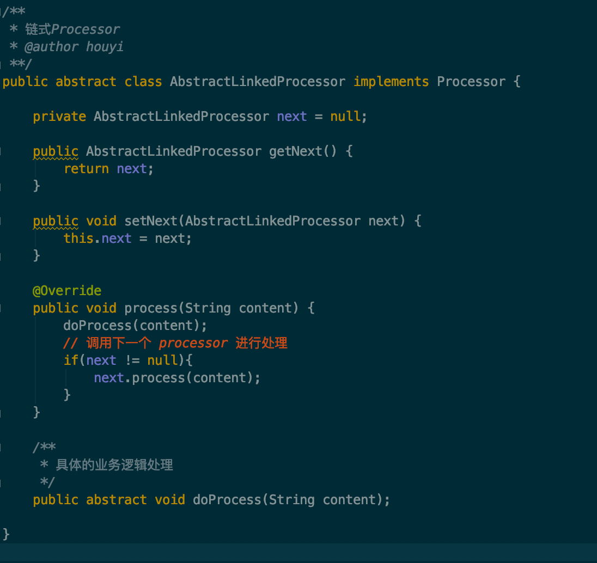
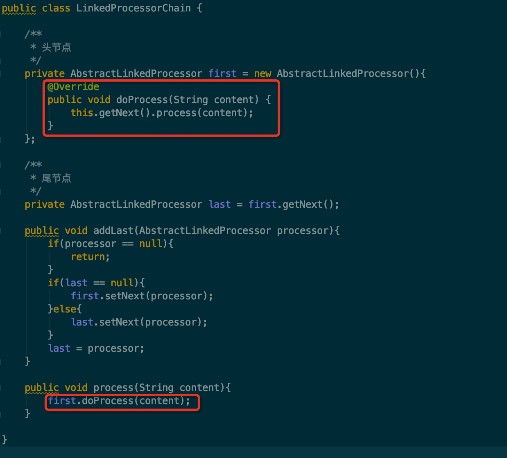
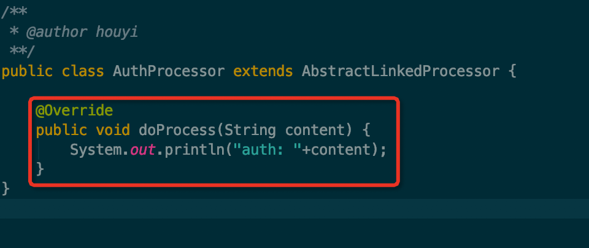

# 责任链

我在 Redant 中实现的拦截器所使用的责任链，其实是通过了一个 List 来保存了所有的 Interceptor，那我们通常所说的责任链除了使用 List 来实现外，还可以通过真正的链表结构来实现，Netty 和 Sentinel 中都有这样的实现，下面我来实现一个简单的链式结构的责任链。

责任链的应用已经有很多了，这里不再赘述，假设我们需要对前端提交的请求做以下操作：鉴权，登录，日志记录，通过责任链来做这些处理是非常合适的。

首先定义一个处理接口，如下图所示：

通过 List 方式的实现很简单，只需要把每个 Processor 的实现类添加到一个 List 中即可，处理的时候遍历该 List 依次处理，这里不再做具体的描述，感兴趣的可以自行实现。

## 定义节点

如果是通过链表的形式来实现的话，首先我们需要有一个类表示链表中的某个节点，并且该节点需要有一个同类型的私有变量表示该节点的下个节点，这样就可以实现一个链表了，如下图所示：

## 定义容器

接着我们需要定义一个容器，在容器中有头，尾两个节点，头结点作为一个空节点，真正的节点将添加到头结点的 next 节点上去，尾节点作为一个指针，用来指向当前添加的节点，下一次添加新节点时，将从尾节点处添加。有了具体的处理逻辑之后，实现起来就很简单了，这个容器的实现如下图所示：

## 定义实现类

下面我们可以实现具体的 Processor 来处理业务逻辑了，只要继承 AbstractLinkedProcessor 即可，如下图所示：

其他两个实现类： LoginProcessor ，LogProcessor 类似，这里就不贴出来了。

然后就可以根据规则来组装所需要的 Processor 了，假设我们的规则是需要对请求依次进行：鉴权，登录，日志记录，那组装的代码如下图所示：

执行该代码，结果如下图所示：

## 存在的问题

看的仔细的同学可以发现了，在 AuthProcessor 的业务逻辑实现中，除了执行了具体的逻辑代码之外，还调用了一行 super.process(content) 代码，这行代码的作用是调用链表中的下一个节点的 process 方法。但是如果有一天我们在写自己的 Processor 实现类时，忘记调用这行代码的话，会是怎样的结果呢？

结果就是当前节点后面的节点不会被调用，整个链表就像断掉一样，那怎样来避免这种问题的发生呢？其实我们在 AbstractProcessor 中已经实现了 process 方法，该方法就是调用下个节点的 process 方法的。那我们在这个方法触发调用下个节点之前，再抽象出一个用以具体的业务逻辑处理的方法 doProcess ，先执行 doProcess 方法，执行完之后再触发下个节点的 process ，这样就不会出现链表断掉的情况了，具体的实现如下图所示：

相应的 LinkedProcessorChain 和具体的实现类也要做响应的调整，如下图所示：

重新执行刚刚的测试类，发现结果和之前的一样，至此一个简单的链式责任链完成了。